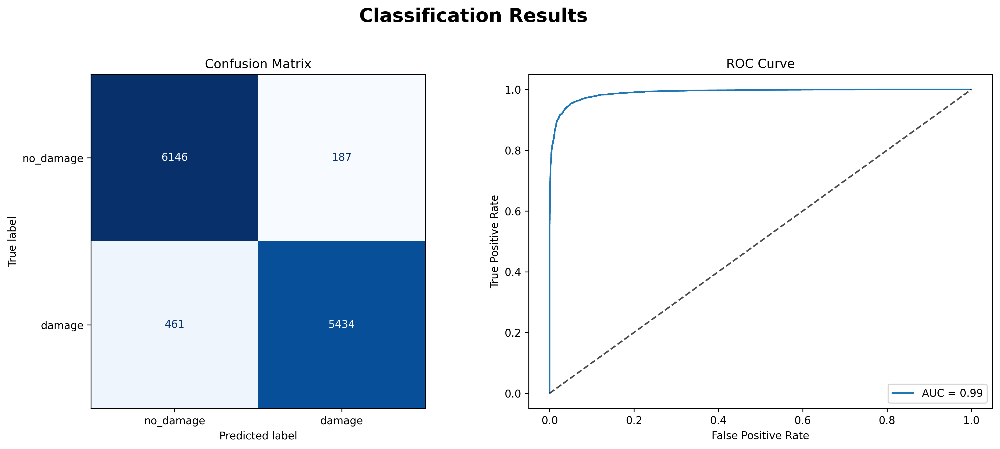

<p align="center">
  
</p>

<h1 align="center">RiskScope: Automated detection and classification of hurricane-induced structural damage using deep learning on aerial or satellite imagery.</h1>
 

## Introduction

Hurricane damage assessment is a critical step for disaster response and resource allocation. Manual evaluation of satellite or aerial images is labor-intensive, slow, and susceptible to subjective interpretation. 

This repository contains all code, utilities, and documentation for building, training, evaluating, and deploying deep learning models for hurricane damage assessment. The goal is to provide an end-to-end framework supporting data ingestion, preprocessing, model training, performance evaluation, and result visualization in a scalable and maintainable manner.

**Key Advantages:**
- **Reproducibility**: The pipeline is modular and fully configurable.
- **Speed**: Supports batch inference and efficient data loading.
- **Explainability**: Integrated GradCAM visualizations for model interpretability.
- **Flexibility**: Works with both scratch-trained and pretrained models, enabling transfer learning and faster experimentation.
---
## Dataset Structure:

This project utilizes a public dataset of hurricane damage imagery, prepared for binary image classification.

### Classes:
- no_damage (undamaged properties/areas)
- damage (visibly damaged properties/areas)

### Image Size:
  - Original: 128x128x3 pixels (RGB)
  - Resized for model: 224x224x3 pixels (RGB)

### Folder Organization:

  ```bash
  data/train_hurricane/
      no_damage/
          img1.jpg
          img2.jpg
          ...
      damage/
          img101.jpg
          img102.jpg
          ...
  data/test_hurricane/
      no_damage/
      damage/
  ```
### Image Count:
  - Training: ~1,358 images
  - Validation: ~271 images (automatically split)
  - Test: ~12,228 images

### Download:
The dataset is automatically downloaded and extracted by the pipeline, or can be manually accessed [here](https://drive.google.com/uc?id=1pByxsenTnJGBKnKhLTXBqbUN_Kbm7PNK)

## Model Pipeline Overview

### 1. Data Preparation
- Download and extract hurricane imagery datasets from Google Drive.
- Organize data into standard train/validation/test splits.
- **Augmentation**: Standard augmentation applied to training data for robustness.

### 2. Model Building & Training

- **Base Model**: ResNet50 pre-trained on ImageNet.
- **Custom Layers**: Dense, Dropout, BatchNormalization, Sigmoid output for binary classification.
- **Training Phases**:
  - **Phase 1 (Ph1):** Train only custom (top) layers with base (ResNet) frozen.
  - **Phase 2 (Ph2):** Fine-tune last convolutional block of ResNet (except batchnorm), enabling deeper feature adaptation.

<p align="center">
  
</p>

### 3. Model Evaluation
- Predict on the test set.
- Output confusion matrix, accuracy/loss curves, and full classification report.
- Visualize and save false positive/negative samples, category grids, and GradCAM overlays.

### 4. Pretrained Models
Pretrained models for this project are **not stored in the repository** due to their size.  
Instead, you can download them from the following Google Drive folder and  store them under `pretrained_models/`:

[Download Pretrained Models (Google Drive)](https://drive.google.com/drive/folders/1ufAXL1uJoydDQ85pfs6wNTj3SRVkFO8Y?usp=sharing)


  - Ph1 – Custom layers trained, base frozen
    ```
    Model file: 'riskscope_resnet50_224x224_b32_e20_ph1_stdaug_YYYYMMDD.keras' (93MB)
    ```

  - Ph2 – Last conv block unfrozen, fine-tuned
    ```
    Model file: 'riskscope_resnet50_224x224_b32_e10_ph2_stdaug_YYYYMMDD.keras' (207MB)
    ```
You may switch between them by updating PRETRAINED_MODEL_PATH in config.py.

---

## Usage Instructions

### 1. Clone and Set Up

```bash
git clone <your-repo-url>
cd Hurricane_damage-detector
uv pip install -e .
```

### (Optional) Configure Pipeline
Edit riskscope/config.py to set paths, batch sizes, augmentation, etc.

- To use a pretrained model:

```python
USE_PRETRAINED = True
PRETRAINED_MODEL_PATH = "pretrained_models/hurricane_resnet50_224x224_b32_e20_ph1_stdaug_20250703.keras"
Set USE_PRETRAINED = False to train from scratch.
```
### 2. Run the Pipeline
```bash
uv run -m riskscope.main
```
The script will download data, train or load the model, run evaluation, and save results in outputs/.

# Output Examples
### Classification Summary:
1. ### When using pretrained models:
   
  
  - #### Confusion Matrix (Left Panel)
    - Provides a detailed breakdown of the model's predictions versus the true labels.
       - Top-left (True Negatives): Number of no_damage images correctly classified as no_damage.
       - Top-right (False Positives): Number of no_damage images incorrectly classified as damage.
       - Bottom-left (False Negatives): Number of damage images incorrectly classified as no_damage.
       - Bottom-right (True Positives): Number of damage images correctly classified as damage.
    - Quickly assess the types of errors the model is making and the balance of performance across classes. 
  - #### ROC Curve and AUC Score (Right Panel)
    - The ROC (Receiver Operating Characteristic) curve plots the true positive rate against the false positive rate at various threshold settings. The closer the curve is to the upper left corner, the better the model performance. The Area Under the Curve (AUC) provides a single scalar value for overall classification quality. Here, an AUC of 0.99 indicates excellent discrimination between classes. The diagonal line Represents a random classifier (AUC = 0.5).

2. ### When training a new model:
 

- Accuracy Curves (Middle Panel)
   - Shows training and validation accuracy over all epochs. Vertical dashed lines (if present) indicate phase changes.
  - Track model learning progression, diagnose overfitting/underfitting, and evaluate the effect of transfer learning or fine-tuning phases. A closing gap between curves suggests reduced overfitting and robust generalization.

- Loss Curves (Right Panel)
   - Shows training and validation loss over all epochs.
  - Analyze the speed and stability of convergence, and check whether training improvements translate to better validation performance. Consistently decreasing curves indicate proper model convergence while sudden increases in validation loss may point to overfitting.

### False Positives/Negatives Grid:

### GradCAM Visualizations:

### Sample Images by Prediction Category:

All generated outputs are saved as both .png and .tiff in the outputs/ directory.

## Acknowledgments
Project developed as part of Constructor Academy AI Bootcamp, 2025.

Initial dataset: Google Drive Dataset

## Contact
For questions, please contact:
- Daniel Rodriguez Gutierrez
- rodriguez.gutierrez.dan@gmail.com
