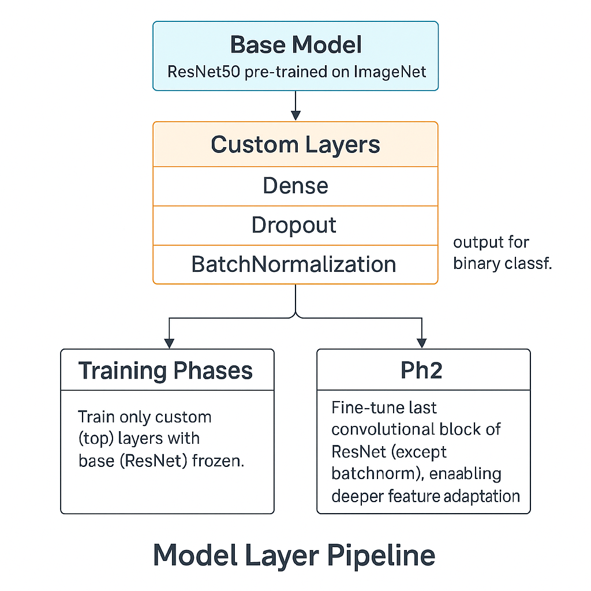
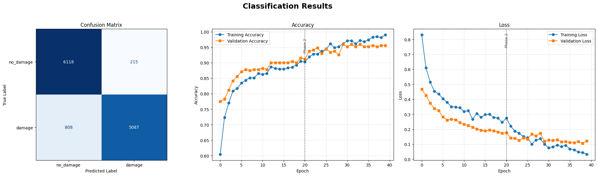
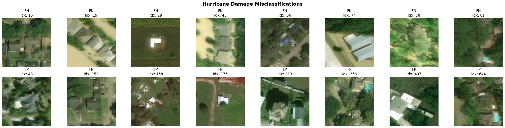
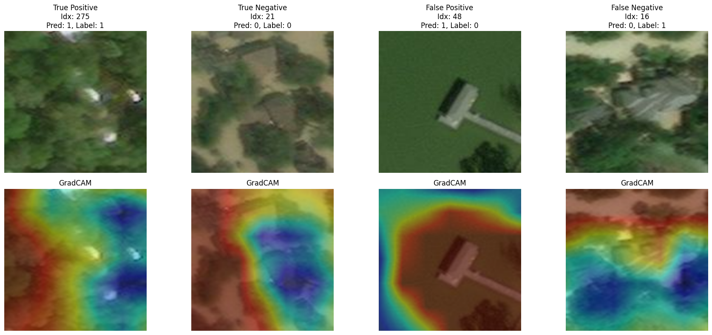
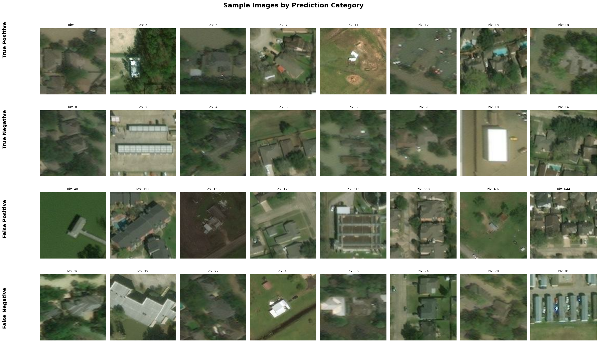

<p align="center">
  
</p>

<h1 align="center">RiskScope: Automated detection and classification of hurricane-induced structural damage using deep learning on aerial or satellite imagery.</h1>
 

## Introduction

Hurricane damage assessment is a critical step for disaster response and resource allocation. Manual evaluation of satellite or aerial images is labor-intensive, slow, and susceptible to subjective interpretation. 

This repository contains all code, utilities, and documentation for building, training, evaluating, and deploying deep learning models for hurricane damage assessment. The goal is to provide an end-to-end framework supporting data ingestion, preprocessing, model training, performance evaluation, and result visualization in a scalable and maintainable manner.

**Key Advantages:**
- **Reproducibility**: The pipeline is modular and fully configurable.
- **Speed**: Supports batch inference and efficient data loading.
- **Explainability**: Integrated GradCAM visualizations for model interpretability.
- **Flexibility**: Works with both scratch-trained and pretrained models, enabling transfer learning and faster experimentation.

---

## Model Pipeline Overview

### 1. Data Preparation
- Download and extract hurricane imagery datasets from Google Drive.
- Organize data into standard train/validation/test splits.
- **Augmentation**: Standard augmentation applied to training data for robustness.

### 2. Model Building & Training

- **Base Model**: ResNet50 pre-trained on ImageNet.
- **Custom Layers**: Dense, Dropout, BatchNormalization, Sigmoid output for binary classification.
- **Training Phases**:
  - **Phase 1 (Ph1):** Train only custom (top) layers with base (ResNet) frozen.
  - **Phase 2 (Ph2):** Fine-tune last convolutional block of ResNet (except batchnorm), enabling deeper feature adaptation.

<p align="center">
  
</p>

### 3. Model Evaluation
- Predict on the test set.
- Output confusion matrix, accuracy/loss curves, and full classification report.
- Visualize and save false positive/negative samples, category grids, and GradCAM overlays.

### 4. Pretrained Models
Pretrained models for this project are **not stored in the repository** due to their size.  
Instead, you can download them from the following Google Drive folder and  store them under `pretrained_models/`:

[Download Pretrained Models (Google Drive)](https://drive.google.com/drive/folders/1ufAXL1uJoydDQ85pfs6wNTj3SRVkFO8Y?usp=sharing)


  - Ph1 – Custom layers trained, base frozen
    ```
    Model file: 'riskscope_resnet50_224x224_b32_e20_ph1_stdaug_YYYYMMDD.keras' (93MB)
    ```

  - Ph2 – Last conv block unfrozen, fine-tuned
    ```
    Model file: 'riskscope_resnet50_224x224_b32_e10_ph2_stdaug_YYYYMMDD.keras' (207MB)
    ```
You may switch between them by updating PRETRAINED_MODEL_PATH in config.py.

---

## Usage Instructions

### 1. Clone and Set Up

```bash
git clone <your-repo-url>
cd Hurricane_damage-detector
uv pip install -e .
```

### (Optional) Configure Pipeline
Edit riskscope/config.py to set paths, batch sizes, augmentation, etc.

- To use a pretrained model:

```python
USE_PRETRAINED = True
PRETRAINED_MODEL_PATH = "pretrained_models/hurricane_resnet50_224x224_b32_e20_ph1_stdaug_20250703.keras"
Set USE_PRETRAINED = False to train from scratch.
```
### 2. Run the Pipeline
```bash
uv run -m riskscope.main
The script will download data, train or load the model, run evaluation, and save results in outputs/.
```
# Output Examples
### Classification Summary:
 

### False Positives/Negatives Grid:

### GradCAM Visualizations:

### Sample Images by Prediction Category:

All generated outputs are saved as both .png and .tiff in the outputs/ directory.

## Acknowledgments
Project developed as part of Constructor Academy AI Bootcamp, 2025.

Initial dataset: Google Drive Dataset

## Contact
For questions, please contact:
- Daniel Rodriguez Gutierrez
- rodriguez.gutierrez.dan@gmail.com
